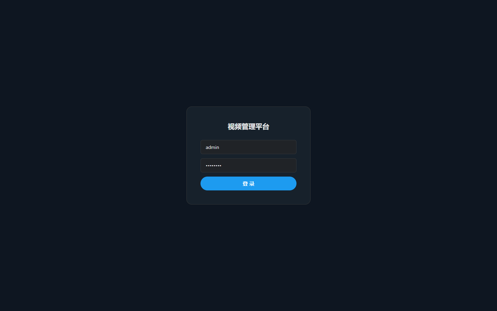
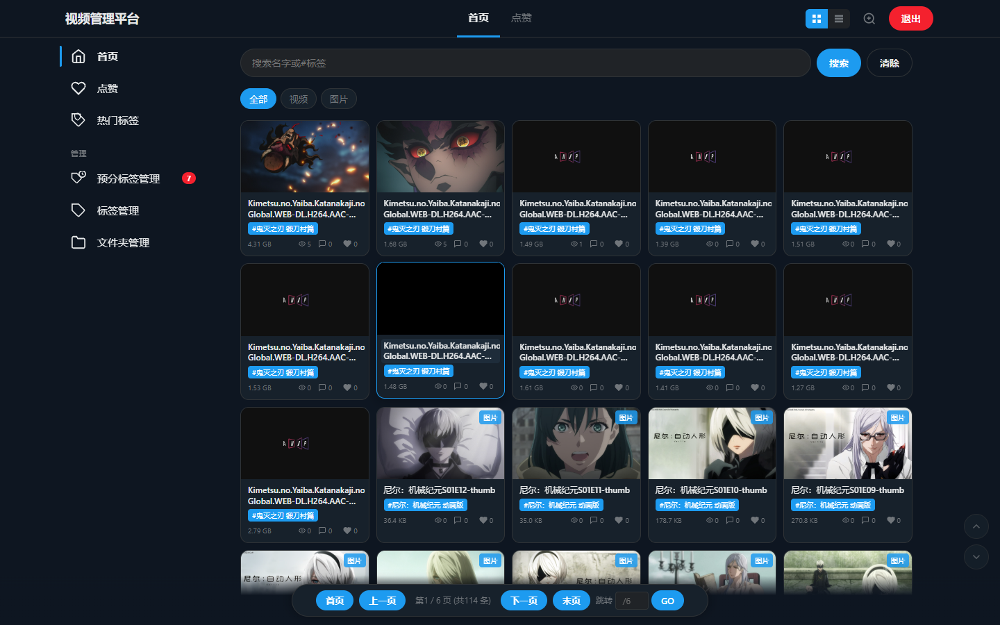
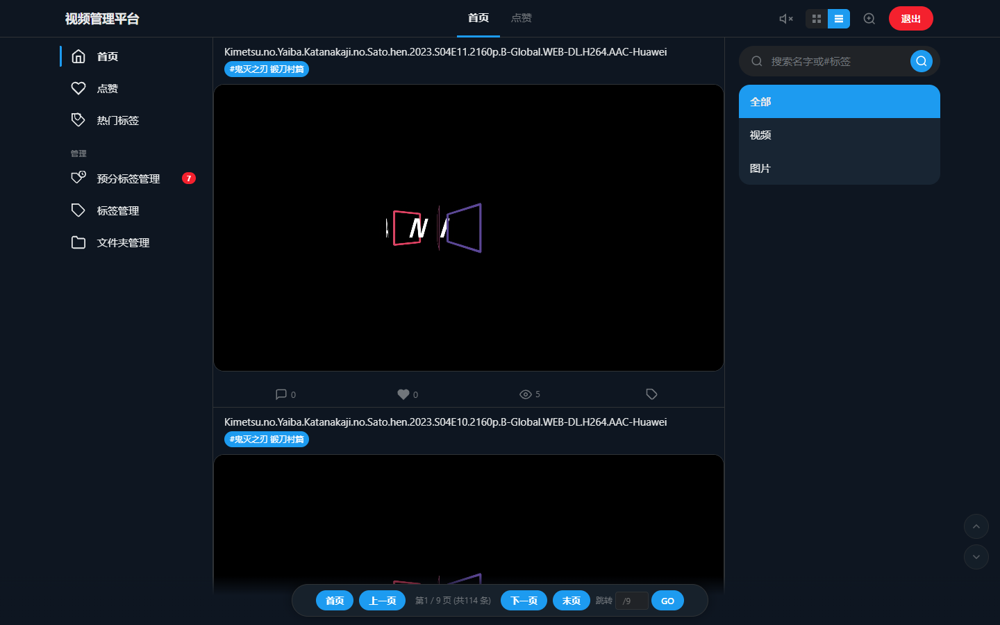
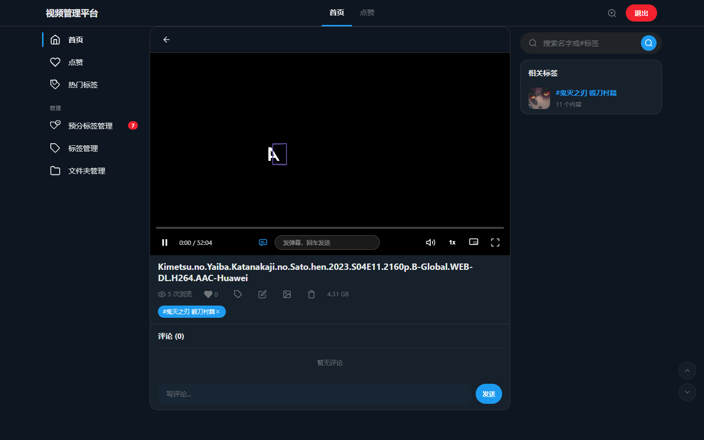
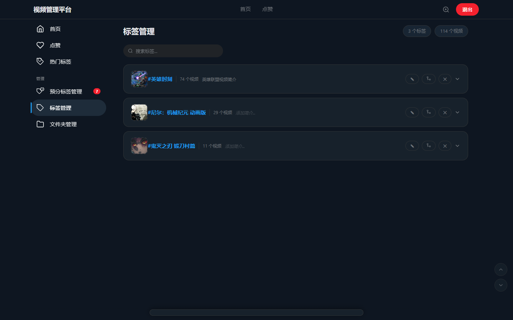

# MediaBox

本地视频/图片媒体管理系统，支持自动标签、弹幕播放、文件夹扫描。

## 截图

| 登录页 | 首页 (网格模式) |
|--------|----------------|
|  |  |

| 首页 (推特流模式) | 视频详情 |
|-------------------|----------|
|  |  |

| 标签管理 |
|----------|
|  |

## 技术栈

| 模块 | 技术 |
|------|------|
| 后端 | Spring Boot 2.7 + MyBatis + H2 + Redis |
| 前端 | 原生 HTML/CSS/JS |
| 工具 | ffmpeg (视频缩略图生成) |

## 功能特性

### 媒体管理
- 文件夹扫描导入视频和图片
- 支持 mp4、webm、avi、mov、mkv、flv 等视频格式
- 支持 jpg、png、gif、webp 等图片格式
- 缩略图自动生成（ffmpeg 智能截取，跳过黑帧）
- 文件重命名、删除

### 标签系统
- 根据文件名/目录名自动生成预分标签
- 预分标签管理：确认、拒绝、重命名、批量操作
- 标签管理：重命名、删除、封面设置、简介编辑
- 热门标签展示
- 标签搜索

### 播放器
- 视频播放：弹幕、画中画、倍速（0.25x-3x）、进度条
- 图片/GIF 查看
- 浏览计数

### 展示模式
- 图标网格模式（默认）
- 推特流模式（自动播放）
- 沉浸式画廊模式
- 轮播焦点模式

### 其他
- 用户登录（默认账号 admin / admin123）
- 搜索（支持名字和标签）
- 点赞、评论、弹幕
- 多用户隔离（页面状态按用户存储）
- H2 数据库控制台（访问 /h2）

## 快速开始

### 环境要求

- Java 8+（推荐 Java 17 或 21）
- Maven 3.6+
- Redis
- ffmpeg（用于缩略图生成，可选）

### 1. 启动 Redis

```bash
redis-server
```

### 2. 启动后端

```bash
cd backend

# 编译打包
mvn clean package -DskipTests

# 运行
java -jar target/backend-1.0.0.jar
```

或者在 IDEA 中直接运行 `ChatApplication.java`。

### 3. 访问

浏览器打开 http://localhost:8080

默认账号：`admin` / `admin123`

### 4. ffmpeg 配置（可选）

缩略图生成功能需要 ffmpeg。将 ffmpeg.exe 放到 `backend/tools/` 目录下，或修改 `application.yml` 中的路径：

```yaml
chat:
  ffmpeg-path: D:/tools/ffmpeg.exe
```

## 项目结构

```
media-box/
├── README.md
├── backend/                        # 后端服务
│   ├── pom.xml                     # Maven 配置
│   ├── assets/                     # README 截图
│   └── src/main/
│       ├── java/com/chat/
│       │   ├── ChatApplication.java    # 启动类
│       │   ├── config/WebConfig.java   # Web 配置（CORS、静态资源）
│       │   ├── controller/             # API 接口
│       │   ├── service/                # 业务逻辑
│       │   ├── mapper/                 # MyBatis Mapper
│       │   ├── model/                  # 数据模型
│       │   └── interceptor/            # 登录拦截器
│       └── resources/
│           ├── application.yml         # 应用配置
│           ├── schema.sql              # 数据库建表语句
│           └── mapper/                 # MyBatis XML
└── frontend/                       # 前端页面
    ├── index.html                  # 主页面
    ├── css/style.css               # 样式
    └── js/app.js                   # 逻辑
```

## 配置说明

`backend/src/main/resources/application.yml` 主要配置项：

| 配置项 | 说明 | 默认值 |
|--------|------|--------|
| server.port | 服务端口 | 8080 |
| spring.redis.host | Redis 地址 | localhost |
| spring.redis.port | Redis 端口 | 6379 |
| spring.redis.password | Redis 密码 | 123456 |
| chat.thumb-dir | 缩略图存储目录 | ./thumbnails |
| chat.thumb-max-mb | 缩略图最大容量(MB) | 500 |
| chat.ffmpeg-path | ffmpeg 路径 | 见配置文件 |

## API 接口

| 接口 | 方法 | 说明 |
|------|------|------|
| /api/login | POST | 用户登录 |
| /api/videos | GET | 视频列表（分页、搜索、筛选） |
| /api/videos/{id} | GET | 视频详情 |
| /api/videos/{id} | DELETE | 删除视频 |
| /api/videos/{id}/like | POST | 点赞/取消点赞 |
| /api/videos/{id}/comments | GET/POST | 评论列表/添加评论 |
| /api/videos/{id}/danmaku | GET/POST | 弹幕列表/发送弹幕 |
| /api/videos/{id}/tags | POST/DELETE | 添加/删除标签 |
| /api/categories | GET | 分类列表 |
| /api/tags | GET | 所有标签 |
| /api/tags/{tag}/videos | GET | 标签下视频 |
| /api/folders | GET/POST/DELETE | 文件夹管理 |
| /api/folders/{id}/scan | POST | 扫描文件夹 |
| /api/stream/video/{id} | GET | 视频流 |
| /api/stream/thumb/{id} | GET | 缩略图 |

## License

MIT
